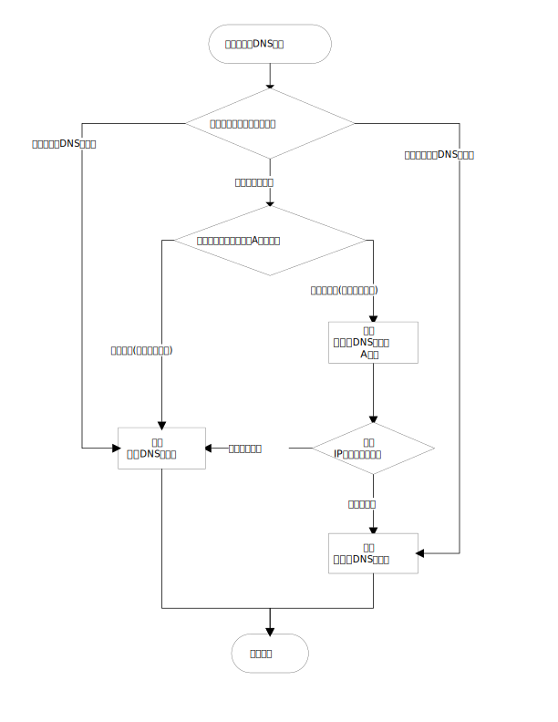

# fcdns
DNS relay server with fact-checking.

## Install
```sh
# Please do not use Yarn v1 to install this package globally, Yarn v1 cannot properly patch dependencies.
npm install --global fcdns
```

## Usage
```sh
Usage: fcdns [options]

DNS relay server with fact-checking.

Options:
  -V, --version                output the version number
  --test-server <server>
  --untrusted-server <server>
  --trusted-server <server>
  --port <port>                   (default: "53")
  --ip-whitelist <filename>       (default: "ip-whitelist.txt")
  --hostname-whitelist <filename> (default: "hostname-whitelist.txt")
  --hostname-blacklist <filename> (default: "hostname-blacklist.txt")
  --route-cache <filename>        (default: "route.txt")
  --test-cache <filename>         (default: "test.txt")
  --test-timeout <ms>             (default: "200")
  --log <level>                   (default: "info")
  --loose-mode
  -h, --help                      display help for command
```

Example:
```sh
fcdns \
  --test-server=162.125.7.1 \
  --untrusted-server=127.0.0.1:5301 \
  --trusted-server=127.0.0.1:5302
```

## 原理


## 必要条件
使用fcdns需要指定3个服务器地址, 1份IP地址白名单, 1份主机名白名单.

### 投毒测试服务器(test server)
投毒测试服务器是一台非DNS服务器,
当客户端向该远程主机的53端口发送DNS查询(question)时, 查询将会超时或被拒绝.
当网络内存在DNS污染时, 向该远程主机发送DNS查询时, 将得到查询结果(answer).
基于此上述两个事实, fcdns通过查询A记录的方式以判断相关主机名是否被投毒.

通常, 在存在DNS污染的网络里, 任意不提供DNS服务器功能的在线主机都可以作为投毒测试服务器使用.
由于投毒测试可能由于网络原因导致失败, 为了能够区分网络原因导致的失败,
fcdns会在发出DNS查询的同时发出ping, 因此投毒测试服务器必须能够被ping通.

fcdns会持久化缓存投毒测试的结果, 同一个主机名只在第一次查询时会经历投毒测试.

### 不可信DNS服务器(untrusted server)
不可信DNS服务器是一台DNS服务器, 客户端与该服务器的连接是被污染的, 或该服务器可能返回被污染的结果.
从该服务器返回的结果虽然并不总是可信, 但借助投毒测试, 可以从中筛选出大量的可信结果.

之所以需要依赖不可信DNS服务器, 是因为不可信DNS服务器通常比可信DNS服务器更快响应, 且返回的结果更准确.

*fcdns只具有最低限度的DNS功能, 强烈建议使用CoreDNS等程序建立本地DNS服务器作为代理.*

### 可信DNS服务器(trusted server)
可信DNS服务器是一台DNS服务器, 客户端与该服务器的连接是不被污染的, 且该服务器不会返回被污染的结果.

之所以需要可信DNS服务器, 是为了能够查询那些被投毒的主机名的正确记录.
可信DNS服务器返回的结果可能并不总是最准确, 但至少是具备可用性的.

*fcdns只具有最低限度的DNS功能, 强烈建议使用CoreDNS等程序建立本地DNS服务器作为代理.*

### IP地址白名单(ip whitelist)
IP地址白名单用于指定允许用"不可信DNS服务器"返回的IP地址或IP地址范围,
所有不在白名单内的IP地址都会转用"可信DNS服务器"进行二次查询.

如果DNS查询返回了多条A记录, 则只要有一条A记录的IP地址与白名单匹配, 就算作命中.

fcdns会持久化缓存查询最终选择的服务器, 同一个主机名只在第一次查询时会被IP地址白名单影响.

fcdns之所以使用白名单而不是黑名单, 是因为在真实世界的案例中, 白名单所需的内容条数较少.

#### 文件格式
白名单是一个文本文件, 以行为分隔符储存地址或地址范围.
地址范围由起点IP和终点IP组成, 以`-`相连.

IPv4地址示例:
```
1.1.1.1
```

IPv6地址示例:
```
2606:4700:4700::1111
```

IPv4地址范围示例:
```
1.0.1.0-1.0.3.255
```

IPv6地址范围示例:
```
2001:250::-2001:252:ffff:ffff:ffff:ffff:ffff:ffff
```

如果不需要此功能, 则只需要将白名单设置为:
```
0.0.0.0-255.255.255.255
::-ffff:ffff:ffff:ffff:ffff:ffff:ffff:ffff
```

### 主机名白名单(hostname whitelist)
主机名白名单用于强制使某些主机名在解析时使用不可信DNS服务器, 其优先级高于fcdns里的其他规则.

### 主机名黑名单(hostname blacklist)
主机名白名单用于强制使某些主机名在解析时使用可信DNS服务器, 其优先级低于白名单, 高于fcdns里的其他规则.

#### 文件格式
白名单是一个文本文件, 以行为分隔符存储主机名模式.
主机名模式使用`*`作为通配符, 可以匹配任意个字符.
fcdns认为的合法主机名模式只能由数字, 字母, 连字符(`-`), 点(`.`), 通配符(`*`)组成.

主机名模式示例:
```
wikipedia.org
*.wikipedia.org
```

## 宽松模式
在宽松模式下, 当相关主机名不存在路由缓存时(即第一次查询该主机名), 会立即查询不可信服务器并返回记录, 然后在后台执行投毒测试和路由缓存.

宽松模式通过降低fcdns的准确性, 提升了在可信信道不稳定情况下的用户体验, 这适用于只有少数主机名被投毒的环境.

## 性能
fcdns不是作为高性能DNS服务器开发的, 选择Node.js栈完全是出于开发方面的便利性.
fcdns的性能经过测试足以应付日常使用.

如果阅读fcdns的源代码, 则会发现一些可能进一步优化的部分,
不实施这些优化的主要原因是为了避免降低代码的可读性.

### 延迟
fcdns存在一些可以被注意到的延迟:
- 投毒测试
- 可信DNS服务器在无缓存的情况下被查询
- 不可信DNS服务器在无缓存的情况下被查询
- IP地址范围白名单

其中"可信DNS服务器"和"不可信DNS服务器"的延迟可以通过使用设置带有缓存的本地DNS服务器降至最低.

投毒测试的最大延迟由超时时间决定,
由于超时时间不应该设定为一个过低的值(建议至少为200ms), 因此首次投毒测试的延迟无法被消除.
随着fcdns的运行, 投毒测试的延迟将由于缓存的存在变得可以被忽略.

检查一个IP地址是否处于IP地址范围白名单内目前是通过遍历实现的,
在有5000条地址范围的情况下, 根据硬件的不同, 有可能会出现个位数毫秒的计算时间.
理论上可以通过将地址范围排序后做二分查找来加速此过程, 但暂未实现.

## 资源占用
### 硬盘占用
fcdns的缓存文件会在启动时自动压缩, 但在运行时是仅追加(append)的,
出现相同域名的并行查询时, 会重复写入相同的记录.
如果有非常大量完全不同域名的查询, 则缓存文件可能导致硬盘占用增加, 但在大部分场景下应该无需担心.

fcdns有两个缓存文件, 分别缓存投毒测试结果和路由结果.
由于路由缓存的优先级更高, 因此投毒测试缓存对于路由缓存来说是冗余的.
fcdns保留投毒测试缓存是考虑到了收集投毒测试结果的需要, 以及清空路由缓存的场景.

### 内存占用
fcdns的内存缓存受V8引擎的实现限制, 且缓存是只增不减的.
根据经验, Node.js程序的内存占用量通常会是使用类似数据类型的本地程序的两倍以上.
如果有非常大量完全不同域名的查询, 则内存缓存可能导致内存占用增加, 但在大部分场景下应该无需担心.

## 针对fcdns的攻击
### 以黑名单/白名单形式污染DNS服务器
禁止向非DNS服务器发送DNS数据包将会破坏fcdns的投毒测试功能.

### 无差别污染主机名
劫持所有DNS响应将会破坏fcdns的投毒测试功能.

### 随机投毒
随机投毒将会使fcdns生成错误的缓存记录.

### 禁止ping
禁止发送ping(echo request)或丢弃reply(echo reply)将会破坏fcdns的投毒测试功能.
