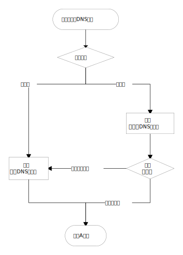

# fcdns

Fact-check DNS.

## Install

```sh
npm install --global fcdns
# or
yarn global add fcdns
```

### Install from source

```sh
git clone git@github.com:BlackGlory/fcdns.git
cd fcdns
yarn install
yarn build
yarn global add "file:$(pwd)"
```

## Usage

```sh
Usage: fcdns [options]

Fact-check DNS.

Options:
  -V, --version                output the version number
  --test-server <server>
  --untrusted-server <server>
  --trusted-server <server>
  --port <port>                 (default: "53")
  --whitelist <filename>        (default: "whitelist.txt")
  --route-cache <filename>      (default: "route.txt")
  --test-cache <filename>       (default: "test.txt")
  --test-timeout <ms>           (default: "200")
  --log <level>                 (default: "info")
  -h, --help                   display help for command
```

Example:
```sh
fcdns \
  --test-server=162.125.7.1 \
  --untrusted-server=127.0.0.1:5301 \
  --trusted-server=127.0.0.1:5302
```

## 必要条件

使用fcdns需要指定3个服务器地址和1份IP地址范围白名单.

### 投毒检测服务器

投毒检测服务器是一个非DNS服务器, 向其53端口发送DNS查询将会失败.
当存在DNS污染时, 向该服务器查询A记录将得到结果, fcdns基于此判断相关主机名是否被投毒.

通常, 在存在DNS污染的网络里, 任意不提供DNS功能的在线主机都可以作为投毒检测服务器使用.
由于投毒测试可能由于网络原因而失败, 为了能够区分网络原因导致的失败, 投毒检测服务器必须能ping通.

### 不可信DNS服务器

不可信DNS服务器是一个DNS服务器, 它处于会被投毒的网络里, 且具有不可靠的信道(UDP).
从该服务器返回的结果并不总是可信的, 通过投毒测试, 可以筛选出可信的结果.

之所以需要不可信DNS服务器, 是因为不可信DNS服务器通常比可信DNS服务器更快响应, 且返回的结果更准确.

由于fcdns只具有最低限度的DNS功能, 因此建议使用CoreDNS等程序建立本地DNS服务器作为代理.

### 可信DNS服务器

可信DNS服务器是一个DNS服务器, 它要么处于不会投毒的网络里, 要么具有可靠的信道(例如DoT, DoH).
从该服务器返回的结果总是可信的.

之所以需要可信DNS服务器, 是为了能够查询那些被投毒的主机名, 返回的结果虽然不总是准确, 但至少可用.

由于fcdns只具有最低限度的DNS功能, 因此建议使用CoreDNS等程序建立本地DNS服务器作为代理.

### IP地址范围白名单

IP地址范围白名单用于指定允许用"不可信DNS服务器"返回的IP地址,
所有不在白名单内的IP地址会转用"可信DNS服务器"进行二次查询.
如果DNS查询返回了多条A记录, 则只要有一条A记录的IP地址位于白名单范围内, 就算命中.
fcdns会缓存DNS的查询路径, 只有在第一次查询相关域名时会发生二次查询, 之后都会直接查询上一次查询的服务器.

白名单是一个文本文件, 以行为分隔符储存地址范围, 地址范围由起点IP和终点IP组成, 以`-`相连.

IPv4地址范围示例:
```
1.0.1.0-1.0.3.255
```

IPv6地址范围示例:
```
2001:250::-2001:252:ffff:ffff:ffff:ffff:ffff:ffff
```

如果不需要此功能, 则只需要将白名单设置为:
```
0.0.0.0-255.255.255.255
::-ffff:ffff:ffff:ffff:ffff:ffff:ffff:ffff
```

fcdns之所以使用白名单而不是黑名单,
是因为在真实世界的案例中, 白名单所需的内容条数更少, 对性能的影响相对较小.

## 流程图



## 性能

fcdns不是作为高性能DNS服务器开发的, 选择Node.js完全是出于开发方面的便利性.
它的性能足以应付日常使用, 但未必适合作为网关运行.

### 硬盘占用

fcdns的缓存文件会在启动时自动压缩, 但在运行时是仅追加(append)的,
出现相同域名的并行查询时, 会重复写入相同的记录.
如果有非常大量不同域名的查询, 则缓存文件可能导致硬盘占用大量增加.

### 内存占用

fcdns的内存缓存受V8引擎的内存布局限制, 且缓存是只增不减的.
通常来说, Node.js程序的内存占用量会是相同结构的native程序的两倍以上.
如果有非常大量不同域名的查询, 则内存缓存可能导致内存占用大量增加.

### 延迟

fcdns存在在以下可观测到的延迟, 按预期的延迟大小降序排序如下:
- 可信DNS服务器(无缓存)
- 投毒检测服务器
- 不可信DNS服务器(无缓存)
- IP地址范围白名单

"可信DNS服务器"和"不可信DNS服务器"的延迟可以通过使用设立带有缓存的本地DNS服务器得到最大程度的降低.

投毒检测服务器的最大延迟由超时时间决定, 但超时时间不应该设定为一个过低的值(建议至少为200ms),
因此投毒测试的延迟无法消除.
由于投毒测试的结果会缓存, 因此投毒测试的延迟只会出现在每个域名的首次查询中,
随着fcdns的运行, 投毒测试的延迟将变得可以忽略.

IP地址范围白名单由于计算会产生一些延迟, 有5000条地址范围的情况下, 可能会出现个位数毫秒的延迟.
该延迟可以通过编写Native插件或以高性能编程语言重写而得到最大程度的降低.
出于成本原因, fcdns未优化此延迟.

## 针对fcdns的攻击

### DNS服务器黑名单/白名单

禁止向非DNS服务器发送DNS查询数据包将会破坏fcdns的投毒检测功能.

### 禁止ping

禁止发送ping(echo request)或丢弃reply(echo reply)会破坏fcdns的投毒检测功能.

### 无差别污染

劫持所有DNS响应将会破坏fcdns的投毒检测功能.

## 暂未实现的功能

- [ ] 复用相同域名的并行查询
